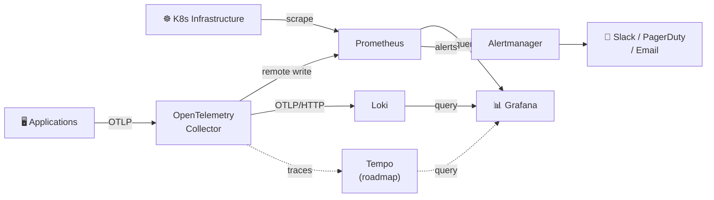

# k8scope

[](https://github.com/y0s3ph/k8scope/actions/workflows/ci.yaml)
[](https://github.com/y0s3ph/k8scope/actions/workflows/release.yaml)
[](https://goreportcard.com/report/github.com/y0s3ph/k8scope)
[](https://github.com/y0s3ph/k8scope/releases/latest)
[](go.mod)
[](LICENSE)

**Opinionated observability stack for Kubernetes.**

Deploy Prometheus, Grafana, Loki, Alertmanager, and OpenTelemetry Collector with battle-tested defaults in one command. Stop spending days configuring YAML — start observing your cluster in minutes.

> [!WARNING]
> k8scope is in early development. APIs and configuration may change.

## 🔥 The Problem

Setting up observability on Kubernetes means:

- Configuring `kube-prometheus-stack` (4000+ lines of values.yaml)
- Adding Loki separately with its own Helm chart
- Setting up OpenTelemetry Collector pipelines for app telemetry
- Connecting datasources in Grafana manually
- Importing dashboards that may or may not work
- Writing alerting rules from scratch (or living with 200 noisy defaults)
- Figuring out retention, storage, ingress, and auth

**This takes 2-5 days for an experienced SRE.** k8scope reduces it to one command.

---

<details>
<summary><strong>Table of Contents</strong></summary>

- [Architecture](#️-architecture)
- [Deployment Modes](#-deployment-modes)
- [Quick Start](#-quick-start)
  - [Installation](#installation)
  - [Basic Usage](#basic-usage)
- [What Gets Installed](#-what-gets-installed)
  - [Core Components](#core-components)
  - [OpenTelemetry Collector Modes](#opentelemetry-collector-modes)
- [Curated Dashboards](#-curated-dashboards)
- [Curated Alerting Rules](#-curated-alerting-rules)
  - [Critical Alerts](#critical-alerts)
  - [Warning Alerts](#warning-alerts)
  - [Info Alerts](#info-alerts)
- [Configuration](#️-configuration)
  - [CLI Flags](#cli-flags)
  - [Configuration File](#configuration-file)
  - [Preflight Checks](#preflight-checks)
- [Connecting Your Applications](#-connecting-your-applications)
  - [Sending Metrics via OTLP](#sending-metrics-via-otlp)
  - [Sending Logs via OTLP](#sending-logs-via-otlp)
- [Component Defaults by Mode](#-component-defaults-by-mode)
  - [Prometheus](#prometheus)
  - [Grafana](#grafana)
  - [Loki](#loki)
  - [Alertmanager](#alertmanager)
  - [OpenTelemetry Collector](#opentelemetry-collector)
- [For GitOps Users](#-for-gitops-users)
- [Building from Source](#️-building-from-source)
- [Testing](#-testing)
- [Roadmap](#️-roadmap)
- [License](#-license)

</details>

---

## 🏗️ Architecture

k8scope deploys a hybrid observability architecture where Prometheus handles Kubernetes infrastructure metrics via scraping, while OpenTelemetry Collector acts as the unified ingestion layer for application telemetry via OTLP:



**Signal flow:**

1. **Metrics (infrastructure)** — Prometheus scrapes kubelet, kube-state-metrics, and node-exporter endpoints.
2. **Metrics (application)** — Apps send OTLP metrics to the OTel Collector, which writes them to Prometheus via remote write.
3. **Logs** — The OTel Collector collects container logs from each node and receives application logs via OTLP. All logs are forwarded to Loki.
4. **Alerts** — Prometheus evaluates k8scope's curated alerting rules and sends notifications through Alertmanager.
5. **Visualization** — Grafana comes pre-wired to both Prometheus and Loki datasources, with 5 curated dashboards ready out of the box.

---

## 🎯 Deployment Modes

k8scope provides opinionated defaults for every stage of your infrastructure:

| Mode | Target | Replicas | Storage | Retention | OTel Collector | Auth |
|------|--------|----------|---------|-----------|----------------|------|
| `dev` | Local testing | 1 | Ephemeral | Session | No | None |
| `startup` | Small clusters (≤10 nodes) | 1 | 10Gi PVC | 7 days | DaemonSet | Basic |
| `production` | Growing teams (10-50 nodes) | 2-3 (HA) | 50Gi PVC | 30 days | DaemonSet + Gateway | Basic |
| `enterprise` | Large orgs (50+ nodes) | 2-3 (HA) | External (S3/GCS) | 90 days | Gateway (multi-tenant) | OIDC/SSO |

**How to choose:**

- **`startup`** — You're a small team, want reliable metrics and logs with minimal overhead, and don't need HA. This is the default and the recommended starting point.
- **`production`** — You need high availability, longer retention, and your team is growing. Alertmanager routes to real notification channels.
- **`enterprise`** — You need SSO, multi-tenant isolation, and external durable storage for compliance or cost optimization.

---

## ⚡ Quick Start

### Installation

**Binary (macOS / Linux / Windows):**

Download the latest release from the [releases page](https://github.com/y0s3ph/k8scope/releases/latest):

```bash
# macOS (Apple Silicon)
curl -sL https://github.com/y0s3ph/k8scope/releases/latest/download/k8scope_$(curl -s https://api.github.com/repos/y0s3ph/k8scope/releases/latest | grep tag_name | cut -d '"' -f4 | sed 's/v//')_darwin_arm64.tar.gz | tar xz
sudo mv k8scope /usr/local/bin/

# Linux (amd64)
curl -sL https://github.com/y0s3ph/k8scope/releases/latest/download/k8scope_$(curl -s https://api.github.com/repos/y0s3ph/k8scope/releases/latest | grep tag_name | cut -d '"' -f4 | sed 's/v//')_linux_amd64.tar.gz | tar xz
sudo mv k8scope /usr/local/bin/
```

**Container image:**

```bash
docker pull ghcr.io/y0s3ph/k8scope:latest
```

### Basic Usage

```bash
# Install the lightweight stack for a small cluster
k8scope install --mode startup

# Preview what would be installed (no changes applied)
k8scope install --mode production --dry-run

# Install in a custom namespace
k8scope install --mode startup --namespace monitoring

# Check stack health
k8scope status

# Remove everything
k8scope uninstall
```

---

## 📦 What Gets Installed

### Core Components

| Component | Chart | Purpose | Modes |
|-----------|-------|---------|-------|
| **Prometheus** | `kube-prometheus-stack` | Metrics collection, storage, and alerting engine | All |
| **Grafana** | `grafana` | Dashboards and visualization with pre-wired datasources | All |
| **Loki** | `loki` | Log aggregation and querying | All |
| **Alertmanager** | Bundled in `kube-prometheus-stack` | Alert routing, grouping, and deduplication | startup+ |
| **OTel Collector** | `opentelemetry-collector` | Unified telemetry pipeline (OTLP ingest, log collection) | startup+ |
| **Node Exporter** | Bundled in `kube-prometheus-stack` | Host-level metrics (CPU, memory, disk, network) | All |
| **kube-state-metrics** | Bundled in `kube-prometheus-stack` | Kubernetes object metrics (deployments, pods, nodes) | All |

All Helm charts are **embedded in the k8scope binary** — no internet connection or Helm repositories required at install time.

### OpenTelemetry Collector Modes

The OTel Collector deployment topology scales with your needs:

| Mode | Deployment | Role |
|------|------------|------|
| `startup` | DaemonSet | Collects node logs, receives app OTLP data, exports to Prometheus and Loki |
| `production` | DaemonSet + Gateway | DaemonSet collects per-node data, Gateway centralizes processing and routing |
| `enterprise` | Gateway (HA) | Tenant-aware routing, sampling, rate limiting, and filtering |

Applications instrumented with OpenTelemetry SDKs can send metrics, logs, and traces to the Collector's OTLP endpoint out of the box — no additional configuration needed.

---

## 📊 Curated Dashboards

k8scope ships with **5 focused dashboards** instead of dozens of generic ones. Each dashboard includes template variables for namespace filtering and auto-configured datasource references:

| Dashboard | Description | Key Panels |
|-----------|-------------|------------|
| **Cluster Overview** | Bird's-eye view of the entire cluster | Node count, pod status, CPU/memory usage, top namespaces by resource, cluster events |
| **Node Resources** | Per-node hardware utilization | CPU usage per core, memory usage vs available, disk I/O, network bandwidth per interface |
| **Pod Resources** | Per-pod resource consumption | CPU/memory requests vs actual usage, restart count, container status, OOMKill history |
| **Networking** | Network traffic and errors | Bytes received/transmitted per pod, packet drop rate, DNS lookup latency, connection states |
| **Logs Overview** | Centralized log exploration | Log volume by namespace/pod, error rate over time, log stream browser, full-text search |

All dashboards are stored as JSON files and provisioned automatically via Grafana's sidecar mechanism with the `k8scope-dashboard` label.

---

## 🚨 Curated Alerting Rules

k8scope ships with **17 alerting rules** organized by severity. Each alert includes a descriptive summary, detailed description, and a `runbook_url` for remediation guidance. All rules carry the `k8scope: "true"` label for easy identification.

### Critical Alerts

These alerts require **immediate action** and should be routed to paging systems (PagerDuty, Opsgenie, phone calls):

| Alert | Condition | `for` |
|-------|-----------|-------|
| `KubeNodeNotReady` | A node has been in NotReady state | 5m |
| `KubePodCrashLooping` | Pod has restarted more than 5 times in 15 minutes | 0m |
| `KubePVCFillingUp` | PVC is >90% full and predicted to fill in 4 hours | 5m |
| `PrometheusDown` | A Prometheus target is unreachable | 3m |
| `ClusterCPUOvercommit` | CPU requests exceed 90% of total allocatable | 10m |
| `ClusterMemoryOvercommit` | Memory requests exceed 90% of total allocatable | 10m |

### Warning Alerts

These alerts require attention on the **next business day** and should be routed to Slack/email:

| Alert | Condition | `for` |
|-------|-----------|-------|
| `KubePodNotReady` | Pod has been not-ready for an extended period | 15m |
| `KubeDeploymentReplicasMismatch` | Available replicas don't match desired count | 15m |
| `KubeContainerOOMKilled` | Container was OOMKilled in the last hour | 0m |
| `KubeHPAMaxedOut` | HPA has been at max replicas for 30 minutes | 30m |
| `NodeHighCPU` | Node CPU usage above 80% | 30m |
| `NodeHighMemory` | Node memory usage above 85% | 30m |
| `NodeDiskPressure` | Root filesystem usage above 80% | 15m |
| `LokiIngestionErrors` | Loki is experiencing append failures | 10m |

### Info Alerts

These alerts are **informational** — useful for audit trails and dashboards, but don't require notification:

| Alert | Condition | `for` |
|-------|-----------|-------|
| `KubeDeploymentRollingUpdate` | A deployment rollout is in progress | 0m |
| `KubeNamespaceTerminating` | A namespace has been terminating (possibly stuck finalizers) | 5m |
| `PrometheusRuleFailures` | Prometheus is failing to evaluate some rules | 10m |

---

## ⚙️ Configuration

k8scope accepts configuration via CLI flags, a YAML config file, or both. When both are provided, **CLI flags take precedence** over values in the config file.

### CLI Flags

```bash
k8scope install [flags]

Flags:
  --mode string        Deployment mode: startup, production, enterprise (default "startup")
  --namespace string   Target Kubernetes namespace (default "k8scope")
  --kubeconfig string  Path to kubeconfig file (default: $KUBECONFIG or ~/.kube/config)
  --dry-run            Preview installation plan without applying changes
  --config string      Path to k8scope configuration file
```

### Configuration File

Config file auto-discovery order: `.k8scope.yaml` (current dir) > `$HOME/.k8scope.yaml`.

```yaml
mode: production
namespace: monitoring
kubeconfig: ~/.kube/config

components:
  prometheus:
    replicas: 2
    storage: 50Gi
    retention: 30d
  grafana:
    replicas: 2
  loki:
    replicas: 3
    storage: 50Gi
    retention: 30d
  otelCollector:
    mode: daemonset+gateway

ingress:
  enabled: true
  className: nginx
  domain: observability.company.com
  tls: true
```

### Preflight Checks

Before installing, k8scope automatically verifies:

| Check | Description |
|-------|-------------|
| **Cluster connectivity** | Validates the kubeconfig and confirms the API server is reachable |
| **Kubernetes version** | Ensures the cluster runs a supported version (≥1.25) |
| **Resource availability** | Checks that the cluster has enough CPU and memory to run the selected mode |
| **Storage class** | Verifies that a default StorageClass exists for PVC provisioning |
| **Namespace conflict** | Warns if the target namespace already contains observability components |

If any check fails, k8scope reports the issue and suggests remediation steps before proceeding.

---

## 🔌 Connecting Your Applications

Once k8scope is installed, your applications can send telemetry using the OpenTelemetry Protocol (OTLP). The OTel Collector exposes endpoints inside the cluster automatically.

### Sending Metrics via OTLP

Configure your OpenTelemetry SDK to export metrics to the collector:

```yaml
# Environment variables for any OTel SDK
OTEL_EXPORTER_OTLP_ENDPOINT: "http://k8scope-otel-opentelemetry-collector.k8scope.svc:4317"
OTEL_EXPORTER_OTLP_PROTOCOL: "grpc"
```

Metrics are forwarded from the OTel Collector to Prometheus via remote write and become queryable in Grafana immediately.

### Sending Logs via OTLP

Application logs sent via OTLP are automatically forwarded to Loki:

```yaml
OTEL_EXPORTER_OTLP_ENDPOINT: "http://k8scope-otel-opentelemetry-collector.k8scope.svc:4317"
OTEL_EXPORTER_OTLP_PROTOCOL: "grpc"
OTEL_LOGS_EXPORTER: "otlp"
```

Container logs (stdout/stderr) are collected automatically by the OTel Collector DaemonSet — no application changes needed for basic log collection.

---

## 🔧 Component Defaults by Mode

Below are the concrete values k8scope applies for the `startup` mode. Production and enterprise modes build upon these with additional replicas, storage, and features.

### Prometheus

| Setting | Startup |
|---------|---------|
| Replicas | 1 |
| CPU request / limit | 250m / 1000m |
| Memory request / limit | 512Mi / 2Gi |
| Storage | 10Gi PVC (`ReadWriteOnce`) |
| Retention | 7 days |
| Service name | `k8scope-prom-prometheus` |

Prometheus is configured with `serviceMonitorSelectorNilUsesHelmValues: false`, meaning it will scrape all ServiceMonitors in the cluster regardless of labels.

### Grafana

| Setting | Startup |
|---------|---------|
| Replicas | 1 |
| CPU request / limit | 100m / 500m |
| Memory request / limit | 256Mi / 512Mi |
| Storage | 5Gi PVC |
| Admin password | Auto-generated (retrieve via `kubectl get secret`) |
| Pre-configured datasources | Prometheus, Loki |
| Dashboard provisioning | Sidecar with `k8scope-dashboard` label |

### Loki

| Setting | Startup |
|---------|---------|
| Deployment mode | SingleBinary |
| Replicas | 1 |
| CPU request / limit | 100m / 500m |
| Memory request / limit | 256Mi / 1Gi |
| Storage | 10Gi filesystem PVC |
| Retention | 7 days (168h) |
| Auth | Disabled (single-tenant) |
| Schema | v13 with TSDB store |

### Alertmanager

| Setting | Startup |
|---------|---------|
| Replicas | 1 |
| CPU request / limit | 50m / 200m |
| Memory request / limit | 64Mi / 128Mi |
| Storage | 1Gi PVC |
| Group by | `alertname`, `namespace`, `severity` |
| Group wait / interval | 30s / 5m |
| Repeat interval | 4h (critical: 1h) |

Alertmanager is deployed as part of `kube-prometheus-stack` with three receivers pre-configured: `default`, `critical`, and `null` (for silencing Watchdog alerts). Inhibition rules prevent warning alerts from firing when a matching critical alert is already active.

### OpenTelemetry Collector

| Setting | Startup |
|---------|---------|
| Deployment mode | DaemonSet |
| CPU request / limit | 100m / 500m |
| Memory request / limit | 128Mi / 512Mi |
| Memory limiter | 400 MiB (spike: 100 MiB) |
| Receivers | OTLP (gRPC :4317, HTTP :4318) |
| Exporters | Prometheus remote write, Loki OTLP/HTTP |
| Presets | Log collection, Kubernetes attributes |
| Batch size / timeout | 1024 / 5s |

---

## 🚢 For GitOps Users

k8scope also publishes its Helm chart for direct use with ArgoCD, Flux, or plain Helm:

```bash
helm install k8scope oci://ghcr.io/y0s3ph/k8scope --values custom-values.yaml
```

This is useful if you prefer declarative GitOps workflows over imperative CLI commands, or if you want to manage the observability stack alongside your other Helm releases.

---

## 🛠️ Building from Source

```bash
# Clone the repository
git clone https://github.com/y0s3ph/k8scope.git
cd k8scope

# Build the binary
go build -o k8scope ./cmd/k8scope

# Run tests
go test ./...

# Build with version info (as goreleaser does)
go build -ldflags "-X github.com/y0s3ph/k8scope/internal/cli.version=dev" -o k8scope ./cmd/k8scope
```

**Requirements:**

- Go 1.25+
- Access to a Kubernetes cluster (for E2E tests)

---

## 🧪 Testing

k8scope has two levels of testing:

**Unit tests** — Fast, no cluster required:

```bash
go test ./internal/... ./embed/...
```

**End-to-End tests** — Require a Kind cluster:

```bash
# Create a Kind cluster
kind create cluster --config test/e2e/testdata/kind-config.yaml --name k8scope-e2e

# Run E2E tests
go test -v -tags e2e -timeout 12m ./test/e2e/...

# Clean up
kind delete cluster --name k8scope-e2e
```

E2E tests validate the full installation lifecycle: binary build, `install --mode startup`, pod readiness, `--dry-run` behavior, and error handling for invalid modes.

---

## 🗺️ Roadmap

### v0.1.0 — Core Engine ✅

- [x] CLI scaffolding with mode-based installation plans
- [x] Helm SDK installer engine (install, upgrade, uninstall, status)
- [x] Preflight checks (cluster, version, resources, storage class)
- [x] Configuration file loading with CLI flag override and merge semantics
- [x] CI/CD pipeline with cross-platform builds and container images

### v0.2.0 — Startup MVP ✅

- [x] Embed and deploy Prometheus (`kube-prometheus-stack`)
- [x] Embed and deploy Grafana with auto-configured Prometheus and Loki datasources
- [x] Embed and deploy Loki for log aggregation (SingleBinary mode)
- [x] Enable Alertmanager with basic routing and severity-based receivers
- [x] Deploy OTel Collector DaemonSet with log collection and OTLP receivers
- [x] Create 5 curated Grafana dashboards (Cluster, Node, Pod, Networking, Logs)
- [x] Create 17 curated alerting rules by severity (Critical, Warning, Info)
- [x] E2E test suite with Kind for startup mode validation

### v0.3.0 — Production Mode

- [ ] High availability configuration (multi-replica Prometheus, Grafana, Alertmanager)
- [ ] Retention policies and storage management (50Gi, 30-day retention)
- [ ] OTel Collector Gateway deployment for centralized processing

### v0.4.0 — Developer Experience

- [ ] `status` command with component health checks
- [ ] `upgrade` command with safe rollouts and rollback
- [ ] `uninstall` command with cleanup confirmation
- [ ] `dev` mode with Docker Compose for local development

### v0.5.0 — Enterprise Mode

- [ ] OIDC/SSO authentication for Grafana
- [ ] External storage backends (S3, GCS, Azure Blob)
- [ ] Multi-tenant isolation with per-tenant OTel pipelines

### v1.0.0 — Distribution & Ecosystem

- [ ] Ingress and TLS configuration for all components
- [ ] Helm chart publication to OCI registry
- [ ] Tempo integration for distributed tracing
- [ ] Dedicated documentation site

---

## 📄 License

Apache License 2.0 — see [LICENSE](LICENSE) for details.
